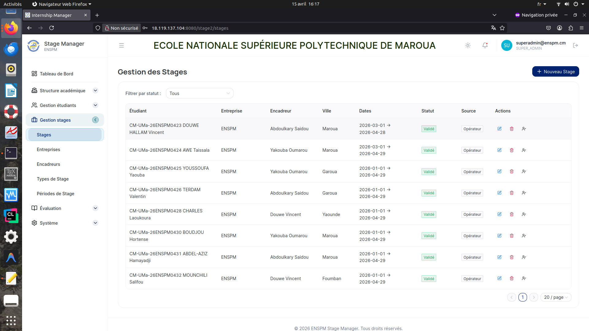
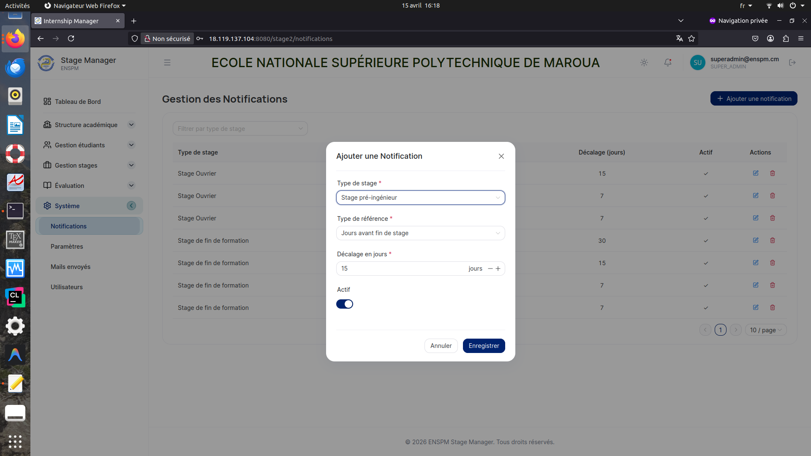
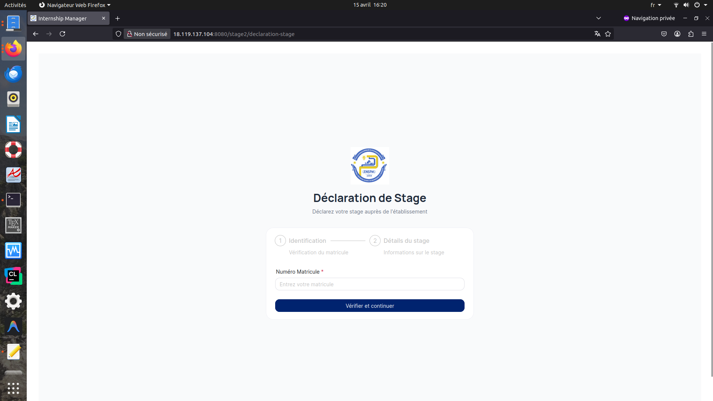
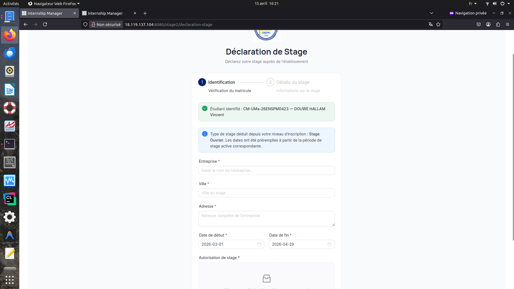

# Manuel Utilisateur Frontend

## Page de garde

- Application: Stage Manager ENSPM
- Document: Manuel Utilisateur Frontend (complet)
- Version: 1.6
- Date d'édition: 21 avril 2026
- Statut: brouillon opérationnel enrichi
- Public cible: utilisateurs métier (scolarité, administration)
- Périmètre: utilisation de l'interface web frontend
- Auteur: Équipe projet Stage Manager ENSPM
- Validateur fonctionnel: à compléter
- Validateur métier: à compléter

### Historique d'approbation

| Date | Validateur | Rôle | Statut | Commentaire |
| --- | --- | --- | --- | --- |
| 15/04/2026 | À compléter | Fonctionnel | En attente | Validation initiale du manuel complet |
| 15/04/2026 | À compléter | Métier | En attente | Relecture métier et conformité process |

---

## 0. Index des captures

Déposez les images dans `docs/images/manuel-complet/` en conservant les noms ci-dessous.
Ordre de prise recommandé: [docs/images/checklist-captures.md](images/checklist-captures.md)

1. `01-login.png` -> section 2.1 Connexion
2. `02-dashboard.png` -> section 4 Tableau de Bord
3. `03-inscriptions-filtres.png` -> section 6.5 Inscriptions
4. `04-inscriptions-modal-ajout.png` -> section 6.5 Inscriptions
5. `05-stages-liste.png` -> section 7.1 Stages
6. `06-stages-assignation-encadreur.png` -> section 7.1.5 Assigner un encadreur
7. `07-evaluations-resultats.png` -> section 8.4 Résultats des évaluations
8. `08-evaluations-export.png` -> section 8.5 Exporter les évaluations
9. `09-systeme-notifications.png` -> section 9.1 Notifications
10. `10-systeme-mails.png` -> section 9.3 Mails envoyés
11. `11-systeme-utilisateurs.png` -> section 9.4 Utilisateurs
12. `12-public-evaluation.png` -> section 10.2 Évaluation encadreur
13. `13-public-stage-declaration-etape-1.png` -> section 10.1.1 Déclaration étudiant, étape 1
14. `14-public-stage-declaration-etape-2.png` -> section 10.1.2 Déclaration étudiant, étape 2

## 1. Objectif du manuel
Ce manuel explique comment utiliser l'application au quotidien: se connecter, naviguer, gérer les données académiques, les étudiants, les stages, les évaluations et les fonctions système.

Ce document est orienté pratique: chaque procédure décrit l'objectif, les étapes et le résultat attendu.

### 1.1 Conventions de lecture
Pour faciliter l'utilisation, toutes les procédures utilisent le même format:

- **Objectif**: ce que vous voulez accomplir.
- **Étapes**: suite d'actions à réaliser dans l'interface.
- **Résultat attendu**: effet normal si tout se passe bien.
- **Erreurs possibles et actions**: conduite à tenir en cas de blocage.

Règles de rédaction appliquées:

- Les noms de menus et boutons sont écrits tels qu'ils apparaissent à l'écran.
- Les chemins de navigation utilisent le format Domaine > Écran.
- Les messages affichés à l'utilisateur sont repris mot à mot quand c'est utile.

## 2. Accès et profils

### 2.1 Connexion
**Objectif**: accéder à l'application avec votre compte.

**Étapes**:

1. Ouvrir la page de connexion.
2. Saisir votre email.
3. Saisir votre mot de passe.
4. Cliquer sur Se connecter.

**Résultat attendu**:

- Vous êtes redirigé vers le Tableau de Bord.
- Votre session reste active tant que vous ne vous déconnectez pas.

**Erreurs fréquentes**:

- Message Email et mot de passe requis: un champ est vide.
- Message Connexion impossible: identifiants invalides ou indisponibilité du service.

Capture suggérée:
- Écran de connexion avec les deux champs et le bouton Se connecter.

### 2.2 Déconnexion
**Objectif**: terminer votre session.

**Étapes**:

1. Cliquer sur l'icône de déconnexion dans l'entête (en haut à droite).

**Résultat attendu**:

- Vous revenez à la page de connexion.
- Votre session locale est supprimée.

### 2.3 Rôles et permissions
Les menus affichés dépendent du rôle connecté.

- Utilisateur standard:
  - Accès aux modules principaux selon politique métier.
- ADMIN:
  - Accès supplémentaire à Mails envoyés.
- SUPER_ADMIN:
  - Accès à Mails envoyés et Utilisateurs.

Note:
- Si vous tentez d'ouvrir un écran non autorisé, vous serez renvoyé vers le Tableau de Bord.

## 3. Prise en main de l'interface

### 3.1 Structure de l'écran
L'interface est composée de:

- Barre latérale (menu principal) à gauche.
- Entête en haut (thème, infos utilisateur, déconnexion).
- Zone centrale de contenu.

### 3.2 Navigation par menu
Les menus sont organisés par domaines:

- Tableau de Bord
- Structure académique
- Gestion étudiants
- Gestion stages
- Évaluation
- Système

### 3.3 Comportements communs
La majorité des écrans utilisent les mêmes interactions:

- Bouton Ajouter pour créer.
- Bouton stylo pour modifier.
- Bouton poubelle pour supprimer avec confirmation.
- Tableau paginé (10, 20, 50 lignes).
- Filtre et recherche pour limiter les résultats.

## 4. Tableau de Bord
**Objectif**: visualiser les indicateurs clés de suivi.

**Étapes**:

1. Ouvrir le menu Tableau de Bord.
2. Lire les cartes d'indicateurs affichées.

**Résultat attendu**:

- Vue synthétique de l'état global (inscriptions, stages, etc.).

**Bonnes pratiques**:

- Utiliser ce tableau en début de journée pour identifier les dossiers en attente.

Capture suggérée:

- Vue complète du Tableau de Bord avec les indicateurs.

## 5. Structure académique

### 5.1 Années Académiques
**Objectif**: gérer les années de référence.

**Étapes**:

1. Ouvrir Structure académique > Années Académiques.
2. Cliquer sur Ajouter.
3. Renseigner les champs demandés.
4. Enregistrer.

**Résultat attendu**:

- L'année apparaît dans la liste.

**Cas d'usage important**:

- Activer l'année courante pour l'utiliser par défaut dans certaines opérations.

### 5.2 Niveaux
**Objectif**: créer et maintenir les niveaux (ex: Niveau 1, Niveau 2, Niveau 3, ...).

**Étapes**:

1. Ouvrir Structure académique > Niveaux.
2. Ajouter, modifier ou supprimer un niveau.

**Résultat attendu**:

- La liste des niveaux est à jour.

### 5.3 Départements
**Objectif**: gérer les départements académiques.

**Étapes**:

1. Ouvrir Structure académique > Départements.
2. Ajouter ou modifier les départements.

**Résultat attendu**:

- Les départements sont disponibles pour la suite (parcours, inscriptions).

### 5.4 Spécialités
**Objectif**: gérer les spécialités.

**Étapes**:

1. Ouvrir Structure académique > Spécialités.
2. Créer ou ajuster les spécialités.

**Résultat attendu**:

- Les spécialités sont visibles dans les sélections métier.

### 5.5 Parcours
**Objectif**: configurer les parcours (combinaison département + niveau + spécialité).

**Étapes**:

1. Ouvrir Structure académique > Parcours.
2. Ajouter un parcours.
3. Sélectionner les éléments demandés.
4. Enregistrer.

**Résultat attendu**:

- Le parcours est disponible pour les inscriptions.

**Point de contrôle**:

- Si un parcours manque, les inscriptions peuvent être bloquées.

## 6. Gestion étudiants

### 6.1 Liste des étudiants
**Objectif**: consulter et gérer les dossiers étudiants.

**Étapes**:

1. Ouvrir Gestion étudiants > Liste des étudiants.
2. Utiliser recherche/tri/pagination si nécessaire.
3. Cliquer sur Ajouter pour créer un dossier.
4. Utiliser Modifier ou Supprimer sur une ligne.

**Résultat attendu**:

- Le tableau reflète les modifications.

### 6.2 Recherche étudiant
**Objectif**: retrouver rapidement un étudiant.

**Étapes**:

1. Ouvrir Gestion étudiants > Recherche étudiant.
2. Saisir un critère (nom, matricule, etc.).
3. Ouvrir le résultat correspondant.

**Résultat attendu**:

- Le bon dossier est identifié.

### 6.3 Importer étudiants (Excel)
**Objectif**: importer plusieurs étudiants en lot.

**Étapes**:

1. Ouvrir Gestion étudiants > Importer étudiants.
2. Sélectionner le fichier Excel conforme au format attendu.
3. Vérifier les retours de validation.
4. Lancer l'import.

**Résultat attendu**:

- Les lignes valides sont importées.
- Les erreurs sont signalées avec détails.

**Erreurs fréquentes**:

- Colonnes manquantes ou nommées différemment.
- Types de données invalides (email, matricule, etc.).

**Bonnes pratiques**:

- Tester d'abord avec un petit fichier avant un import massif.

Capture suggérée:

- Écran import avec aperçu et zone de messages d'erreur.

### 6.4 Détail étudiant
**Objectif**: consulter la fiche complète et les inscriptions associées.

**Étapes**:

1. Depuis la liste, ouvrir la fiche d'un étudiant.
2. Consulter les informations principales.
3. Vérifier les inscriptions liées.

**Résultat attendu**:

- Vue unifiée du profil étudiant.

### 6.5 Inscriptions
**Objectif**: enregistrer les inscriptions académiques.

**Étapes**:

1. Ouvrir Gestion étudiants > Inscriptions.
2. Utiliser les filtres si besoin: année, département, niveau, spécialité, tri.
3. Cliquer sur Ajouter une inscription.
4. Dans la modal:

   - sélectionner l'étudiant,
   - sélectionner le département,
   - sélectionner le niveau,
   - sélectionner la spécialité,
   - enregistrer.

**Résultat attendu**:

- L'inscription est créée et visible dans la liste.

**Règles importantes**:

- La spécialité devient sélectionnable seulement si département et niveau sont choisis.
- L'application bloque les doublons (même étudiant, même année, même parcours).

**Erreurs fréquentes**:

- Message La spécialité est requise: cascade incomplète.
- Message doublon: inscription déjà existante.

Capture suggérée:

- Vue liste avec filtres.
- Modal d'ajout d'inscription avec cascade.

#### 6.5.1 Procédure détaillée: filtrer et retrouver une inscription
**Objectif**: retrouver rapidement un étudiant inscrit pour vérification.

**Étapes**:

1. Aller dans Gestion étudiants > Inscriptions.
2. Dans Rechercher une inscription..., saisir le nom ou le matricule.
3. Si nécessaire, sélectionner Filtrer par année.
4. Si nécessaire, préciser Filtrer par département puis Filtrer par niveau.
5. (Optionnel) sélectionner Filtrer par spécialité.
6. Ajuster Trier par et Ordre pour faciliter la lecture.

**Résultat attendu**:

- Le tableau affiche uniquement les inscriptions correspondant aux critères.

**Points de contrôle**:

- Le changement de filtre relance automatiquement le chargement.
- La pagination est conservée mais repart à la première page lors d'un nouveau filtre.

#### 6.5.2 Procédure détaillée: créer une inscription
**Objectif**: inscrire un étudiant dans un parcours pour une année donnée.

**Préconditions**:

- L'étudiant existe déjà dans la base.
- Les référentiels Département, Niveau, Spécialité et Parcours sont configurés.
- Une année académique active est disponible (recommandé).

**Étapes**:

1. Cliquer sur Ajouter une inscription.
2. Vérifier l'année académique affichée dans la modal.
3. Choisir l'Étudiant.
4. Choisir le Département.
5. Choisir le Niveau.
6. Choisir la Spécialité.
7. Cliquer sur Enregistrer.

**Résultat attendu**:

- Message Inscription ajoutée avec succès.
- La modal se ferme.
- La nouvelle ligne apparaît dans le tableau.

**Erreurs possibles et actions**:

- Message Le département est requis / Le niveau est requis / La spécialité est requise:
  - Compléter les champs manquants.
- Message Cette inscription existe déjà pour cet étudiant, cette année et ce parcours:
  - Vérifier si la ligne existe déjà, sinon corriger le parcours cible.
- Message Impossible d'enregistrer cette inscription (doublon ou données invalides):
  - Vérifier toutes les données puis recommencer.

#### 6.5.3 Procédure détaillée: modifier une inscription
**Objectif**: corriger le parcours d'une inscription existante.

**Étapes**:

1. Dans la ligne concernée, cliquer sur l'icône Éditer.
2. Vérifier l'étudiant et l'année.
3. Modifier Département, Niveau et/ou Spécialité selon besoin.
4. Cliquer sur Enregistrer.

**Résultat attendu**:

- Message Inscription modifiée avec succès.
- Le tableau est mis à jour.

**Point de vigilance**:

- La règle anti-doublon s'applique aussi en modification.

#### 6.5.4 Procédure détaillée: supprimer une inscription
**Objectif**: retirer une inscription incorrecte.

**Étapes**:

1. Dans la ligne concernée, cliquer sur l'icône Supprimer.
2. Dans la confirmation, valider la suppression.

**Résultat attendu**:

- Message Inscription supprimée avec succès.
- La ligne disparaît du tableau.

**Erreurs possibles**:

- Message Erreur lors de la suppression:
  - Recharger la page puis réessayer.
  - Si l'erreur persiste, contacter l'administrateur.

#### 6.5.5 Guide rapide des filtres Inscriptions

- Filtrer par année: isole une campagne académique.
- Filtrer par département + niveau: réduit fortement la liste.
- Filtrer par spécialité: disponible uniquement quand département et niveau sont choisis.
- Trier par étudiant/parcours: facilite le contrôle visuel.
- Ordre croissant/décroissant: change la lecture sans modifier les données.

## 7. Gestion stages

### 7.1 Stages
**Objectif**: créer et suivre les stages.

**Étapes**:

1. Ouvrir Gestion stages > Stages.
2. Cliquer sur Ajouter.
3. Renseigner les informations du stage.
4. Enregistrer.

**Résultat attendu**:

- Le stage est ajouté à la liste.

**Actions fréquentes**:

- Assigner un étudiant.
- Assigner un encadreur.
- Mettre à jour selon l'évolution du dossier.

#### 7.1.1 Procédure détaillée: créer un stage
**Objectif**: créer un dossier de stage complet.

**Étapes**:

1. Ouvrir Gestion stages > Stages.
2. Cliquer sur Nouveau Stage.
3. (Optionnel) sélectionner un étudiant si connu.
4. Sélectionner le type de stage.
5. Saisir le nom de l'entreprise.
6. Si l'entreprise n'existe pas, renseigner aussi le secteur d'activité.
7. Renseigner la ville et l'adresse.
8. Vérifier/ajuster les dates de début et fin.
9. Cliquer sur Enregistrer.

**Résultat attendu**:

- Message Stage créé.
- Le stage apparaît dans la liste.

**Notes utiles**:

- La sélection du type de stage peut préremplir automatiquement les dates depuis la période active.
- Si aucune période active n'existe pour le type choisi, un avertissement est affiché.

#### 7.1.2 Procédure détaillée: modifier un stage

**Objectif**: mettre à jour les informations d'un stage existant.

**Étapes**:

1. Dans la ligne concernée, cliquer sur Éditer.
2. Corriger les champs nécessaires.
3. Cliquer sur Enregistrer.

**Résultat attendu**:

- Message Stage mis à jour.
- Le tableau reflète les changements.

#### 7.1.3 Procédure détaillée: valider ou rejeter un stage
**Objectif**: traiter les stages en attente de validation.

**Étapes**:

1. Filtrer la liste sur En attente de validation si besoin.
2. Dans la ligne concernée, cliquer sur Valider ou Rejeter.

**Résultat attendu**:

- En validation: message Stage validé.
- En rejet: message Stage rejeté.
- Le statut du stage est mis à jour.

#### 7.1.4 Procédure détaillée: assigner un étudiant à un stage
**Objectif**: lier un stage à un étudiant quand le stage a été déclaré sans étudiant.

**Étapes**:

1. Sur un stage sans étudiant, cliquer sur Assigner un étudiant.
2. Rechercher l'étudiant par matricule ou nom.
3. Sélectionner l'étudiant dans la liste.
4. Cliquer sur Assigner.

**Résultat attendu**:

- Message Étudiant assigné avec succès.
- Le nom/matricule s'affiche dans la colonne Étudiant.

#### 7.1.5 Procédure détaillée: assigner un encadreur à un stage
**Objectif**: associer un encadreur au stage.

**Préconditions**:

- Le stage a déjà un étudiant.
- Le stage a une entreprise renseignée.

**Étapes**:

1. Cliquer sur Assigner un encadreur (ou Réassigner un encadreur).
2. Rechercher l'encadreur par nom ou email.
3. Sélectionner l'encadreur proposé.
4. Cliquer sur Assigner.

**Résultat attendu**:

- Message Encadreur assigné avec succès.
- Le nom apparaît dans la colonne Encadreur.

**Cas particulier**: encadreur absent de la liste

1. Dans la modal d'assignation, cliquer sur Créer rapidement.
2. Saisir nom et email.
3. Cliquer sur Créer l'encadreur.
4. Revenir à la sélection et cliquer sur Assigner.

#### 7.1.6 Procédure détaillée: supprimer un stage
**Objectif**: retirer un stage erroné.

**Étapes**:

1. Cliquer sur l'action Supprimer de la ligne.
2. Confirmer la suppression.

**Résultat attendu**:

- Message Stage supprimé.
- Le stage disparaît du tableau.

#### 7.1.7 Guide rapide du filtre statut (stages)

- Tous: affiche l'ensemble des stages.
- En attente de validation: montre les stages à traiter.
- Validé: montre les stages approuvés.
- Rejeté: montre les stages refusés.

### 7.2 Entreprises
**Objectif**: maintenir le référentiel des entreprises.

**Étapes**:

1. Ouvrir Gestion stages > Entreprises.
2. Ajouter, modifier ou supprimer une entreprise.

**Résultat attendu**:

- Les entreprises sont disponibles dans la gestion des stages.

### 7.3 Encadreurs
**Objectif**: gérer les encadreurs liés aux entreprises.

**Étapes**:

1. Ouvrir Gestion stages > Encadreurs.
2. Créer ou modifier un encadreur.
3. Vérifier l'association entreprise.

**Résultat attendu**:

- Encadreurs disponibles lors de l'affectation de stage.

### 7.4 Types de Stage
**Objectif**: paramétrer les catégories de stage.

**Étapes**:

1. Ouvrir Gestion stages > Types de Stage.
2. Ajouter/modifier/supprimer les types.

**Résultat attendu**:
- Référentiel de types à jour.

### 7.5 Périodes de Stage
**Objectif**: définir les périodes officielles.

**Étapes**:

1. Ouvrir Gestion stages > Périodes de Stage.
2. Ajouter une période (dates de début/fin).
3. Enregistrer.

**Résultat attendu**:

- Les périodes sont disponibles pour le cadrage des stages.

## 8. Évaluation

### 8.1 Barèmes
**Objectif**: créer les barèmes de notation.

**Étapes**:

1. Ouvrir Évaluation > Barèmes.
2. Ajouter un barème (code, libellé, état actif/par défaut).
3. Enregistrer.

**Résultat attendu**:

- Barème disponible pour association avec les critères.

### 8.2 Critères
**Objectif**: définir les critères d'évaluation.

**Étapes**:

1. Ouvrir Évaluation > Critères.
2. Ajouter ou modifier les critères (libellé, catégorie).

**Résultat attendu**:

- Critères disponibles dans la configuration des barèmes.

### 8.3 Assoc. Barème-Critères
**Objectif**: affecter des critères à un barème avec coefficient.

**Étapes**:

1. Ouvrir Évaluation > Assoc. Barème-Critères.
2. Sélectionner le barème.
3. Ajouter les critères et leurs coefficients.
4. Enregistrer.

**Résultat attendu**:

- Le barème devient opérationnel pour la notation.

### 8.4 Résultats des évaluations
**Objectif**: consulter les résultats par session.

**Étapes**:

1. Ouvrir Évaluation > Résultats des évaluations.
2. Utiliser filtres/recherche si disponibles.
3. Ouvrir un détail de session.

**Résultat attendu**:

- Visualisation des notes et statuts.

#### 8.4.1 Procédure détaillée: consulter et filtrer les résultats
**Objectif**: trouver rapidement les sessions d'évaluation concernées.

**Étapes**:

1. Ouvrir Évaluation > Résultats des évaluations.
2. Utiliser les filtres département, niveau, spécialité.
3. Saisir un nom ou matricule dans la recherche.
4. Cliquer sur Rechercher.

**Résultat attendu**:

- La liste est filtrée selon les critères.

**Statuts affichés**:

- EN_ATTENTE
- EN_COURS
- TERMINEE

#### 8.4.2 Procédure détaillée: ouvrir le détail d'une session
**Objectif**: analyser une session d'évaluation précise.

**Étapes**:

1. Dans la ligne concernée, cliquer sur Details.

**Résultat attendu**:

- La page de détail de la session s'ouvre.

#### 8.4.3 Procédure détaillée: générer la fiche PDF
**Objectif**: télécharger une fiche d'évaluation individuelle.

**Étapes**:

1. Dans la ligne concernée, cliquer sur Fiche PDF.

**Résultat attendu**:

- Le fichier PDF est généré/téléchargé.

**Erreur possible**:

- Message Impossible de générer la fiche PDF.

### 8.5 Exporter les évaluations
**Objectif**: produire un export des résultats.

**Étapes**:

1. Ouvrir Évaluation > Exporter les évaluations.
2. Choisir les paramètres d'export.
3. Lancer l'export.

**Résultat attendu**:

- Fichier généré et téléchargeable.

#### 8.5.1 Procédure détaillée: assistant d'export en 3 étapes
**Objectif**: générer un export PDF ou Excel par niveau, parcours ou type de stage.

Étape 1: Type d'export

1. Ouvrir Évaluation > Exporter les évaluations.
2. Choisir un type d'export:

  - Par niveau
  - Par parcours
  - Par type de stage
3. Cliquer sur Suivant.

Étape 2: Paramètres

1. Si Par niveau: sélectionner le niveau.
2. Si Par parcours: sélectionner successivement département, niveau, spécialité.
3. Si Par type de stage: sélectionner le type de stage.
4. Choisir le format PDF ou Excel.
5. Cliquer sur Suivant.

Étape 3: Confirmation et téléchargement

1. Vérifier le résumé (type, sélection, format).
2. Cliquer sur Télécharger.

**Résultat attendu**:

- Message de succès d'export.
- Fichier téléchargé.

**Erreurs possibles**:

- Message Complétez les informations de l'export: un paramètre manque.
- Message Impossible d'exporter en PDF/EXCEL: échec côté service.

## 9. Système

### 9.1 Notifications
**Objectif**: configurer les règles de notification.

**Étapes**:

1. Ouvrir Système > Notifications.
2. Créer ou modifier une règle.
3. Définir les paramètres (référence temporelle, décalage, activation).
4. Enregistrer.

**Résultat attendu**:

- Les règles sont appliquées au moteur de notifications.

#### 9.1.1 Procédure détaillée: créer une notification

**Objectif**: ajouter une règle de notification pour un type de stage.

**Étapes**:

1. Ouvrir Système > Notifications.
2. Cliquer sur Ajouter une notification.
3. Sélectionner le Type de stage.
4. Sélectionner le Type de référence (début, fin, jours avant/après fin).
5. Renseigner le Décalage en jours (valeur négative, zéro ou positive).
6. Laisser Actif activé si la règle doit être immédiatement appliquée.
7. Cliquer sur Enregistrer.

**Résultat attendu**:

- Message Notification ajoutée avec succès.
- La ligne apparaît dans le tableau.

#### 9.1.2 Procédure détaillée: modifier ou désactiver une notification

**Objectif**: ajuster une règle existante.

**Étapes**:

1. Cliquer sur Éditer dans la ligne concernée.
2. Modifier les champs nécessaires.
3. Pour désactiver, mettre Actif sur inactif.
4. Cliquer sur Enregistrer.

**Résultat attendu**:

- Message Notification modifiée avec succès.

#### 9.1.3 Procédure détaillée: supprimer une notification

**Objectif**: retirer une règle obsolète.

**Étapes**:

1. Cliquer sur Supprimer.
2. Confirmer la suppression.

**Résultat attendu**:

- Message Notification supprimée avec succès.

#### 9.1.4 Filtrer les notifications

**Objectif**: afficher les règles d'un type de stage précis.

**Étapes**:

1. Utiliser Filtrer par type de stage.
2. Sélectionner un type ou effacer le filtre.

**Résultat attendu**:

- Le tableau est rechargé avec les règles correspondantes.

### 9.2 Paramètres

**Objectif**: gérer les paramètres globaux visibles au frontend.

**Étapes**:

1. Ouvrir Système > Paramètres.
2. Modifier les valeurs autorisées.
3. Enregistrer.

**Résultat attendu**:

- Les paramètres prennent effet selon les règles de l'application.

#### 9.2.1 Procédure détaillée: modifier un paramètre modifiable

**Objectif**: mettre à jour une valeur de configuration applicative.

**Étapes**:

1. Ouvrir Système > Paramètres.
2. Repérer la clé à modifier.
3. Cliquer sur l'icône Modifier (uniquement si la clé est modifiable).
4. Lire la description affichée.
5. Saisir la nouvelle valeur.
6. Cliquer sur Enregistrer.

**Résultat attendu**:

- Message Paramètre mis à jour avec succès.

**Cas particuliers**:

- Paramètre secret: la valeur est saisie en mode mot de passe.
- Paramètre de type texte long: saisie dans une zone multiligne.
- Paramètre non modifiable: action Modifier désactivée.

### 9.3 Mails envoyés (ADMIN et SUPER_ADMIN)

**Objectif**: suivre les envois d'emails système.

**Étapes**:

1. Ouvrir Système > Mails envoyés.
2. Filtrer la liste par statut si nécessaire.
3. Relancer un envoi en échec si option disponible.

**Résultat attendu**:

- Suivi opérationnel de la file d'envoi.

#### 9.3.1 Procédure détaillée: rechercher et filtrer les mails

**Objectif**: retrouver rapidement des envois par destinataire/sujet/statut.

**Étapes**:

1. Ouvrir Système > Mails envoyés.
2. Dans Recherche rapide, saisir un mot-clé (destinataire, sujet, erreur).
3. Utiliser Filtrer par statut si nécessaire (En attente, Envoyé, Échec).

**Résultat attendu**:

- La table affiche les lignes correspondantes.

#### 9.3.2 Procédure détaillée: consulter le détail d'un mail

**Objectif**: analyser le contenu et l'erreur d'un envoi.

**Étapes**:

1. Cliquer sur Détails dans la ligne concernée.
2. Vérifier destinataire, statut, tentatives, erreur et corps du mail.

**Résultat attendu**:

- Modal de détails complète affichée.

#### 9.3.3 Procédure détaillée: relancer un mail en échec

**Objectif**: remettre en file un envoi échoué.

**Étapes**:

1. Sur une ligne en Échec, cliquer sur Relancer.

**Résultat attendu**:
- Message Mail relancé et remis en attente.

Remarque:
- Le bouton Relancer est désactivé pour les statuts autres que Échec.

#### 9.3.4 Procédure détaillée: relance en lot des échecs

**Objectif**: relancer plusieurs mails en échec en une action.

**Étapes**:

1. Cliquer sur Relancer les échecs.

**Résultat attendu**:

- Message indiquant le nombre de mails relancés.

#### 9.3.5 Procédure détaillée: purger les anciens mails

**Objectif**: nettoyer l'historique ancien (envoyés et échoués).

**Étapes**:

1. Saisir le seuil en jours dans Purge: mails de plus de X jours.
2. Cliquer sur Purger anciens mails.
3. Confirmer l'action.

**Résultat attendu**:

- Message indiquant le nombre total de mails purgés.

#### 9.3.6 Procédure détaillée: supprimer une ligne manuellement

**Objectif**: retirer un mail précis de l'historique.

**Étapes**:

1. Cliquer sur Supprimer dans la ligne concernée.
2. Confirmer.

**Résultat attendu**:

- Message Mail supprimé.

### 9.4 Utilisateurs (SUPER_ADMIN)

**Objectif**: administrer les comptes et rôles.

**Étapes**:

1. Ouvrir Système > Utilisateurs.
2. Créer un utilisateur ou modifier un compte existant.
3. Affecter le rôle approprié.
4. Activer/désactiver si besoin.

**Résultat attendu**:

- Compte utilisateur opérationnel avec les droits attendus.

#### 9.4.1 Procédure détaillée: créer un utilisateur

**Objectif**: créer un nouveau compte applicatif.

**Étapes**:

1. Ouvrir Système > Utilisateurs (profil SUPER_ADMIN).
2. Cliquer sur Créer un utilisateur.
3. Renseigner Email, Mot de passe et Rôle.
4. Cliquer sur Créer.

**Résultat attendu**:

- Message Utilisateur créé.
- Le compte apparaît dans la liste.

#### 9.4.2 Procédure détaillée: activer/désactiver un compte

**Objectif**: gérer l'état actif d'un utilisateur.

**Étapes**:

1. Dans la ligne concernée, cliquer sur Désactiver ou Activer.

**Résultat attendu**:

- Message Utilisateur activé ou Utilisateur désactivé.
- Le statut affiché (Actif/Inactif) est mis à jour.

#### 9.4.3 Procédure détaillée: réinitialiser un mot de passe

**Objectif**: définir un nouveau mot de passe pour un utilisateur.

**Étapes**:

1. Cliquer sur Reset MDP dans la ligne concernée.
2. Saisir le nouveau mot de passe dans la fenêtre de saisie.
3. Valider.

**Résultat attendu**:

- Message Mot de passe réinitialisé.

#### 9.4.4 Procédure détaillée: supprimer un utilisateur

**Objectif**: supprimer un compte devenu inutile.

**Étapes**:

1. Cliquer sur Supprimer dans la ligne concernée.
2. Confirmer la suppression.

**Résultat attendu**:

- Message Utilisateur supprimé.

**Point de sécurité**:

- La suppression de votre propre compte connecté est bloquée dans l'interface.

## 10. Parcours publics (sans connexion)

### 10.1 Déclaration de stage étudiant

**Objectif**: permettre la déclaration via lien public.

**Étapes**:

1. Ouvrir le lien public de déclaration.
2. Étape 1 Identification: saisir le Numéro Matricule puis cliquer sur Vérifier et continuer.
3. Étape 2 Détails du stage: renseigner les informations demandées puis cliquer sur Déclarer le stage.

**Résultat attendu**:

- Message Stage déclaré avec succès.
- Le stage passe en attente de validation.

#### 10.1.1 Procédure détaillée: étape 1 (informations étudiant)

**Objectif**: identifier l'étudiant et préparer la déclaration.

**Étapes**:

1. Ouvrir le lien public de déclaration.
2. Vérifier la présence de l'assistant avec les étapes Identification et Détails du stage.
3. Renseigner le champ Numéro Matricule.
4. Cliquer sur Vérifier et continuer.

**Résultat attendu**:

- L'étudiant est identifié.
- Le formulaire passe à l'étape Détails du stage.

Capture suggérée:

- Écran Identification avec le champ Numéro Matricule et le bouton Vérifier et continuer.

**Erreurs possibles et actions**:

- Champ obligatoire manquant:
  - Renseigner le matricule puis cliquer à nouveau sur Vérifier et continuer.
- Message Aucun étudiant trouvé avec le matricule « ... »:
  - Vérifier le matricule saisi puis recommencer.
- Message Impossible de déterminer le type de stage pour cet étudiant:
  - Contacter l'administration pour vérifier les données académiques.

#### 10.1.2 Procédure détaillée: étape 2 (informations stage)

**Objectif**: compléter les données de stage et finaliser l'envoi.

**Étapes**:

1. Vérifier l'encart Étudiant identifié.
2. Vérifier l'encart de contexte Type de stage déduit depuis votre niveau d'inscription.
3. Sur l'étape Détails du stage, renseigner les informations demandées (Entreprise, Ville, Adresse, Date de début, Date de fin).
4. Joindre le fichier Autorisation de stage.
5. Vérifier les données avant soumission.
6. Cliquer sur Déclarer le stage.

**Résultat attendu**:

- Message Stage déclaré avec succès.
- Le stage est en attente de validation par un opérateur.

Capture suggérée:

- Écran Détails du stage avec bouton Déclarer le stage.

**Erreurs possibles et actions**:

- Données incomplètes:
  - Compléter les champs marqués puis soumettre de nouveau.
- Message L'autorisation de stage est obligatoire:
  - Joindre un fichier PDF/image puis relancer la soumission.
- Échec de soumission:
  - Vérifier la connexion réseau puis réessayer.

### 10.2 Évaluation encadreur

**Objectif**: permettre la notation via lien public sécurisé par code.

**Étapes**:

1. Ouvrir le lien d'évaluation contenant le code.
2. Choisir le stage à évaluer.
3. Saisir les notes par critère.
4. Soumettre l'évaluation.

**Résultat attendu**:

- Notes enregistrées et confirmation affichée.

#### 10.2.1 Procédure détaillée: choisir un stage à évaluer

**Objectif**: ouvrir le bon formulaire depuis le lien public.

**Étapes**:

1. Ouvrir le lien public reçu.
2. Vérifier la liste des stages affichés.
3. Cliquer sur « Evaluer » pour le stage souhaité.

**Résultat attendu**:

- Le formulaire d'évaluation du stage s'ouvre.

Cas possibles:

- Si un seul stage reste à évaluer, l'ouverture peut être automatique.
- Si un stage est déjà évalué, le bouton affiche « Deja evalue ».

**Erreurs possibles**:

- Lien d'évaluation introuvable.
- Lien d'évaluation expiré.

#### 10.2.2 Procédure détaillée: remplir et soumettre l'évaluation

**Objectif**: saisir les notes par critère avec contrôle automatique.

**Étapes**:

1. Pour chaque critère, saisir une note.
2. Respecter la borne 0 à coefficient maximum du critère.
3. Ajouter un commentaire optionnel si nécessaire.
4. Cliquer sur « Soumettre l'evaluation ».

**Résultat attendu**:

- Message Évaluation enregistrée avec succès.

**Erreurs possibles**:

- Note manquante sur un critère.
- Note négative.
- Note supérieure au coefficient maximal.
- Cette évaluation a déjà été soumise.

## 11. FAQ rapide

### 11.1 Je ne vois pas un menu attendu
Cause probable:

- Votre rôle ne permet pas cet accès.

Action:

- Contacter un administrateur pour vérifier votre profil.

### 11.2 Une spécialité ne peut pas être choisie dans Inscriptions
Cause probable:

- Département et niveau non sélectionnés.

Action:
- Sélectionner d'abord département puis niveau.

### 11.3 L'import Excel échoue
Causes probables:

- Format de colonnes incorrect.
- Données invalides sur une ou plusieurs lignes.

Action:

- Corriger le fichier selon le modèle attendu et relancer l'import.

### 11.4 Je suis renvoyé vers le Tableau de Bord
Cause probable:

- Accès à une page non autorisée pour votre rôle.

Action:

- Vérifier vos droits avec l'administration.

### 11.5 La recherche ne renvoie aucun résultat
Causes probables:

- Filtres actifs trop restrictifs.
- Erreur de saisie.

Action:

- Effacer les filtres, puis relancer la recherche.

## 12. Plan de captures d'écran (à produire)
Pour finaliser le manuel, produire les captures suivantes:

1. Connexion
- Écran de login complet.

2. Navigation
- Écran principal avec sidebar et entête.

3. Un écran CRUD standard
- Liste + bouton Ajouter + modal création.

4. Inscriptions

- Liste avec filtres.
- Modal avec cascade Département/Niveau/Spécialité.
- Message de doublon.

5. Import étudiants

- Import valide.
- Import avec erreurs.

6. Stages

- Liste stages.
- Modal affectation étudiant/encadreur.

7. Évaluation

- Écran barèmes/critères.
- Résultats des évaluations.
- Export.

8. Système

- Notifications.
- Mails envoyés.
- Utilisateurs (profil super admin).
- Paramètres (clé modifiable et clé non modifiable).
- Purge des mails anciens avec confirmation.
- Détail d'un mail en échec (erreur + corps).

9. Déclaration de stage étudiant (parcours public)

- Étape 1: identification étudiant.
- Étape 2: informations stage + soumission.

## 13. Checklist de recette utilisateur (UAT)
Utiliser cette checklist avant mise en production ou après mise à jour frontend.

1. Authentification

- Connexion valide redirige vers Tableau de Bord.
- Connexion invalide affiche un message explicite.
- Déconnexion renvoie vers Login.

2. Navigation

- Tous les menus visibles ouvrent la bonne page.
- Les menus ADMIN/SUPER_ADMIN respectent les droits.

3. Inscriptions (prioritaire)

- Filtre par année fonctionne.
- Cascade département -> niveau -> spécialité fonctionne.
- Création d'inscription valide fonctionne.
- Blocage des doublons fonctionne.
- Modification et suppression fonctionnent.

4. Étudiants

- Création/modification/suppression fonctionnent.
- Import Excel fonctionne avec un fichier valide.
- Import invalide remonte des erreurs exploitables.

5. Stages

- Création stage fonctionne.
- Affectation étudiant et encadreur fonctionne.
- Validation et rejet des stages en attente fonctionnent.
- Création rapide d'encadreur depuis la modal d'assignation fonctionne.

6. Évaluation

- Configuration barèmes/critères fonctionne.
- Consultation des résultats fonctionne.
- Export des résultats produit un fichier.
- Téléchargement fiche PDF par session fonctionne.

7. Système

- Notifications se créent et se modifient.
- Mail queue visible pour ADMIN/SUPER_ADMIN.
- Gestion utilisateurs accessible uniquement SUPER_ADMIN.
- Purge des anciens mails fonctionne et affiche un compteur.
- Modification des paramètres modifiables fonctionne.
- Action Modifier est inactive pour un paramètre non modifiable.

8. Parcours publics

- Le lien public de déclaration ouvre l'assistant en 2 étapes.
- L'étape 1 étudiant valide les champs obligatoires avant passage à l'étape 2.
- L'étape 2 stage permet la soumission avec confirmation de succès.
- Le lien public d'évaluation ouvre la liste des stages attendus.
- La soumission de l'évaluation respecte la borne 0 à coefficient par critère.
- Un stage déjà évalué apparaît comme « Deja evalue ».

## 14. Limites connues de cette version du manuel
- Ce document est une base opérationnelle v1.
- Certains détails métier précis (format exact de template Excel, règles fines de certains formulaires) doivent être validés avec l'équipe fonctionnelle.
- Après validation terrain, compléter ce manuel avec captures réelles et exemples de jeux de données.

## 15. Journal des mises à jour
- v1.6: réorganisation du manuel en mode inline complet (captures intégrées dans les sections métier au fil du texte).
- v1.5: ajout de la déclaration de stage étudiant en 2 étapes avec captures dédiées (étape 1 et étape 2).
- v1.4: uniformisation éditoriale, conventions de lecture, ajout d'un glossaire métier et création d'une version courte imprimable.
- v1.3: enrichissement pas-à-pas du module Système (Notifications, Paramètres, Mails envoyés, Utilisateurs).
- v1.2: enrichissement pas-à-pas des modules Stages, Résultats/Exports d'évaluation et parcours public encadreur.
- v1.1: enrichissement pas-à-pas du module Inscriptions + checklist de recette utilisateur.
- v1.0: structure initiale complète du manuel frontend (sans captures intégrées).

## 16. Glossaire métier

- Année académique: période de référence de gestion (ex: 2025-2026).
- Parcours: combinaison Département + Niveau + Spécialité.
- Inscription: rattachement d'un étudiant à un parcours pour une année académique.
- Stage: dossier de stage d'un étudiant (entreprise, période, statut, encadrement).
- Type de stage: catégorie de stage (académique, professionnel, etc.).
- Période de stage: intervalle officiel début/fin associé à un type de stage.
- Encadreur: responsable de suivi en entreprise.
- Barème: grille d'évaluation regroupant plusieurs critères.
- Critère: élément noté individuellement dans une évaluation.
- Coefficient: note maximale autorisée pour un critère.
- Session d'évaluation: ensemble des notes d'un stage évalué.
- Mail queue: file d'attente/historique des emails techniques envoyés par l'application.
- Paramètre applicatif: clé de configuration modifiable depuis l'interface (selon droits).
- UAT (User Acceptance Testing): recette utilisateur pour valider que les parcours métier fonctionnent avant mise en production.
